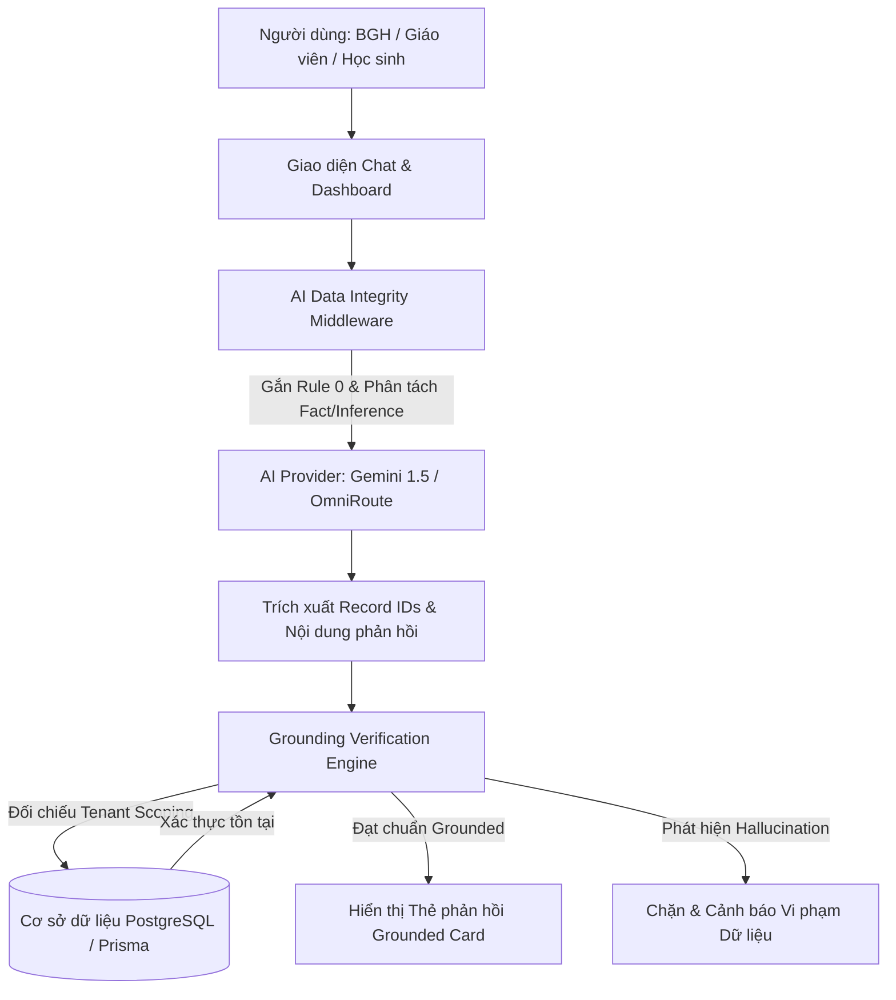
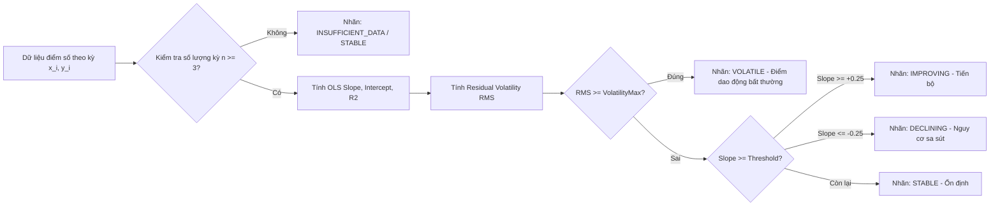
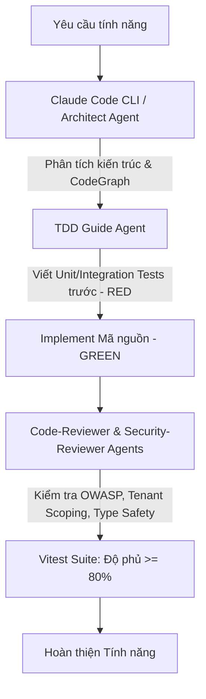

# BÁO CÁO KỸ THUẬT: CÔNG CỤ, MÔ HÌNH, THƯ VIỆN VÀ NỀN TẢNG TRÍ TUỆ NHÂN TẠO (AI) ĐÃ SỬ DỤNG TRONG DỰ ÁN QUẢN LÝ NHÀ TRƯỜNG THÔNG MINH (`SCHOOL-MANAGEMENT`)

---

## I. TỔNG QUAN VÀ MA TRẬN CÔNG NGHỆ AI

Trong dự án **Hệ thống Quản lý Nhà trường Thông minh đa điểm trường (`school-management`)**, Trí tuệ Nhân tạo (AI) và Khoa học Dữ liệu được ứng dụng xuyên suốt ở cả **hai tầng kiến trúc cốt lõi**:
1. **Tầng 1 (AI-Assisted Engineering)**: Các công cụ, nền tảng AI hỗ trợ trực tiếp quy trình phân tích, thiết kế kiến trúc, sinh mã TDD, rà soát an ninh và giả lập dữ liệu vận hành.
2. **Tầng 2 (In-App Intelligent & Analytics Engine)**: Các mô hình ngôn ngữ lớn (LLM), thuật toán học máy (Machine Learning), giải thuật tối ưu hóa ràng buộc (Constraint Satisfaction) và cơ chế kiểm chứng toàn vẹn dữ liệu được nhúng trực tiếp vào sản phẩm.

### Bảng Ma trận Tổng hợp Công nghệ AI

| Nhóm công nghệ | Tên công cụ / Mô hình / Thư viện | Nhà cung cấp / Nền tảng | Vai trò chính trong hệ thống | Giai đoạn áp dụng |
| :--- | :--- | :--- | :--- | :--- |
| **Mô hình Ngôn ngữ lớn (LLM)** | **Google Gemini 1.5 Flash / 2.5 Flash Lite** | Google Cloud / Vertex AI | Trợ lý AI hỏi đáp dữ liệu real-time, gợi ý phương pháp sư phạm, tư vấn tâm lý học đường, sinh kịch bản chỉ đạo BGH. | Vận hành sản phẩm (In-App) |
| **Cổng kết nối AI & Fallback** | **OmniRoute Gateway & Smart Local Fallback** | Tự phát triển (Custom Engine) | Điều phối định tuyến API, cân bằng tải, bảo đảm tính sẵn sàng 24/7 khi mất kết nối Internet. | Vận hành sản phẩm (In-App) |
| **Bảo mật & Kiểm chứng AI** | **AI Data Integrity & Grounding Engine** | Tự phát triển (`src/lib/ai/`) | Phân tách Dữ kiện - Suy luận, bắt buộc trích dẫn `record_id`, quét đối chiếu Database chống ảo giác (Hallucination). | Vận hành sản phẩm (In-App) |
| **Thuật toán Học máy (ML)** | **Hồi quy tuyến tính OLS & Phân tích Độ biến động (RMS Volatility)** | Tự phát triển (`src/lib/student-journey/`) | Dự báo xu hướng học tập dài hạn, tính toán hệ số góc phát triển, phát hiện sớm nguy cơ tụt dốc điểm số. | Vận hành sản phẩm (In-App) |
| **Thuật toán Tối ưu hóa** | **Heuristic Constraint Solver** | Tự phát triển (`src/lib/smart-timetable-engine.ts`) | Xếp thời khóa biểu tự động, giải quyết bài toán ràng buộc giáo viên, phòng học, phân bố đều tiết dạy. | Vận hành sản phẩm (In-App) |
| **Phân tích Thống kê Giáo dục** | **Exam & Assessment Analytics Engine** | Tự phát triển kết hợp `Recharts` | Tính toán phổ điểm, độ lệch chuẩn, phương sai, bách phân vị và độ phân hóa đề thi theo chuẩn Bộ GD&ĐT. | Vận hành sản phẩm (In-App) |
| **Môi trường Phát triển AI** | **Claude Code CLI & Anthropic LLMs (Claude 3.7 Sonnet / Opus)** | Anthropic | Trợ lý lập trình thông minh đa Agent (Architect, TDD Guide, Security Reviewer, Code Reviewer). | Thiết kế, Code, Review |
| **Đồ thị Tri thức Mã nguồn** | **CodeGraph MCP** | SQLite Code Intelligence | Truy vấn cấu trúc mã nguồn, phân tích tác động (Impact Analysis) và luồng phụ thuộc giữa các module. | Thiết kế & Tái cấu trúc |
| **Sinh Dữ liệu Thực tế** | **Realistic Synthetic Data Generator** | Tự phát triển (`prisma/seed.ts`) | Mô phỏng toàn diện dữ liệu điểm số, sổ đầu bài, giáo án điện tử và nhật ký giảng dạy của các điểm trường. | Kiểm thử & Demo |

---

## II. CHI TIẾT CÁC MÔ HÌNH VÀ THUẬT TOÁN AI NHÚNG TRONG SẢN PHẨM (IN-APP AI)

### 1. Mô hình Ngôn ngữ Lớn (LLM) & Trợ lý Điều hành Sư phạm
* **Mô hình sử dụng**: Google Gemini 1.5 Flash và Gemini 2.5 Flash Lite (tích hợp qua OmniRoute Gateway và Google Generative AI API).
* **Vị trí trong mã nguồn**: `src/lib/ai-provider.ts`
* **Vai trò trong sản phẩm**:
  * **Trợ lý Ban Giám hiệu (Decision Support)**: Tự động tổng hợp số liệu từ các điểm trường vệ tinh, phân tích tình trạng thiếu/thừa giáo viên, cơ sở vật chất, tuân thủ Nghị quyết 37 và đề xuất 2 phương án chỉ đạo kèm điểm số ưu/nhược điểm và cơ sở pháp lý.
  * **Trợ lý Giáo viên**: Gợi ý phương pháp tuyên dương học sinh tích cực, đổi mới giáo án, tư vấn can thiệp học sinh cá biệt.
  * **Trợ lý Học sinh**: Hướng dẫn kỹ thuật học tập khoa học (Pomodoro, Spaced Repetition, Mindmap, Mục tiêu SMART).

### 2. Động cơ Kiểm chứng Tính Toàn vẹn Dữ liệu AI (AI Data Integrity & Grounding Engine)
Để giải quyết triệt để rủi ro **Ảo giác (Hallucination)** trong môi trường quản lý giáo dục, hệ thống đã cài đặt cơ chế kiểm soát dữ liệu nghiêm ngặt:
* **Vị trí trong mã nguồn**: `src/lib/ai/data-integrity.ts`
* **Nguyên tắc Tối thượng (Rule 0)**: AI chỉ được phép đưa ra nhận định khi có thể truy vết ngược về một bản ghi có thật trong cơ sở dữ liệu (`student_score`, `attendance`, `intervention_record`,...). Nếu thiếu số liệu, bắt buộc trả về `INSUFFICIENT_DATA`.
* **Cơ chế Phân tách Bắt buộc**:
  * `[DỮ KIỆN]`: Các con số thực tế đi kèm định danh bản ghi dạng `[id=xxx]` hoặc `student_score#id=xxx`.
  * `[SUY LUẬN]`: Các nhận định xu hướng hoặc giả thuyết sư phạm cần con người (Giáo viên/Hiệu trưởng) xác minh trực tiếp.
* **Server-side Grounding Verification**: Sau khi LLM sinh phản hồi, máy chủ tự động bóc tách toàn bộ `record_id`, truy vấn cơ sở dữ liệu theo ngữ cảnh phân quyền đa trường (`schoolId`/`campusId`). Nếu phát hiện ID bịa đặt hoặc sai phân quyền, phản hồi sẽ bị gắn nhãn vi phạm và kích hoạt cơ chế bảo vệ ngay lập tức.

### 3. Mô hình Học máy Hồi quy Tuyến tính OLS (Ordinary Least Squares) & Cảnh báo Sớm
Hệ thống không sử dụng các mô hình "hộp đen" khó giải thích mà ứng dụng mô hình **Hồi quy Tuyến tính OLS** kết hợp **Độ biến động Thặng dư (Residual Volatility)** để phân tích hành trình học tập của từng học sinh:
* **Vị trí trong mã nguồn**: `src/lib/student-journey/regression.ts`, `src/lib/student-journey/journey-engine.ts`

$$\text{Hệ số góc (Slope) } a = \frac{\sum_{i=1}^n (x_i - \bar{x})(y_i - \bar{y})}{\sum_{i=1}^n (x_i - \bar{x})^2}$$

$$\text{Hệ số chặn (Intercept) } b = \bar{y} - a\bar{x}$$

$$\text{Độ biến động thặng dư (RMS Volatility) } = \sqrt{\frac{\sum_{i=1}^n (y_i - \hat{y}_i)^2}{n}}$$

* **Vai trò**:
  * Tự động phân loại trạng thái học sinh: **Tiến bộ (IMPROVING)**, **Sa sút (DECLINING)**, **Bất ổn định (VOLATILE)**, hoặc **Ổn định (STABLE)**.
  * Tự động phát tín hiệu cảnh báo sớm đến giáo viên chủ nhiệm và ban giám hiệu trước khi học sinh rơi vào nhóm học lực yếu hoặc có nguy cơ bỏ học.

### 4. Giải thuật Xếp Thời khóa biểu Tự động (Smart Timetable Constraint Solver)
* **Vị trí trong mã nguồn**: `src/lib/smart-timetable-engine.ts`
* **Giải thuật**: Heuristic Search kết hợp Khử xung đột ràng buộc (Constraint Satisfaction Problem - CSP).
* **Ràng buộc cứng (Hard constraints)**: Một giáo viên không dạy 2 lớp cùng 1 tiết; Một phòng học chuyên dụng không phục vụ 2 lớp cùng lúc; Không vượt quá định mức tiết dạy/tuần.
* **Ràng buộc mềm (Soft constraints)**: Tránh tiết trống lẻ loi giữa các buổi của giáo viên; Cân bằng số tiết giữa các ngày trong tuần; Ưu tiên các môn khoa học vào buổi sáng.

---

## III. CÔNG CỤ & NỀN TẢNG AI HỖ TRỢ QUY TRÌNH PHÁT TRIỂN (AI-ASSISTED DEVELOPMENT)

Quá trình xây dựng dự án `school-management` được thực thi theo phương pháp luận **AI-First Engineering** kết hợp quy chuẩn **Karpathy Guidelines** (Tập trung tính đơn giản, phẫu thuật mã nguồn chính xác, phát triển dựa trên mục tiêu kiểm thử):

### 1. Claude Code CLI & Hệ thống Multi-Agent Chuyên biệt
* **Claude Code CLI**: Môi trường dòng lệnh thông minh tương tác trực tiếp với filesystem, shell và git.
* **Các Agent chuyên biệt được điều phối**:
  * **Architect / Planner Agent**: Thiết kế sơ đồ quan hệ cơ sở dữ liệu Prisma, phân tách module Server Actions, REST APIs và Client Components.
  * **TDD-Guide Agent**: Định hướng viết bài kiểm thử trước khi viết mã nguồn logic (Red-Green-Refactor), bảo đảm độ bao phủ (test coverage) đạt trên 80% với thư viện `Vitest`.
  * **Security-Reviewer Agent**: Quét lỗ hổng SQL Injection, kiểm tra phân quyền đa đối tượng (RBAC), kiểm soát Tenant Scoping (`schoolId`, `campusId`) tránh rò rỉ dữ liệu giữa các trường.
  * **Code-Simplifier & Refactor-Cleaner**: Tối ưu hóa mã nguồn, loại bỏ dead-code, ngăn ngừa đột biến trạng thái (Immutability).

### 2. CodeGraph MCP (Model Context Protocol)
* **Vai trò**: Cung cấp đồ thị tri thức mã nguồn cục bộ dựa trên SQLite AST.
* **Hiệu quả**: Giúp AI nắm bắt toàn bộ cây phân cấp, các điểm gọi hàm (call hierarchy), dynamic dispatch và mối quan hệ giữa hàng trăm files mã nguồn mà không làm tràn Context Window, từ đó đưa ra các chỉnh sửa chính xác tuyệt đối.

### 3. AI Giả lập Dữ liệu Mẫu Thực tế (Realistic Data Simulation)
* **Vị trí trong mã nguồn**: `prisma/seed.ts`
* **Vai trò**: Tự động sinh hàng nghìn bản ghi dữ liệu mẫu có tính liên kết logic sâu sắc:
  * Điểm số thực tế có tính xu hướng theo thời gian để kiểm thử thuật toán OLS.
  * Sổ đầu bài điện tử, giáo án, nhật ký giảng dạy khớp với phân công chuyên môn và lịch giảng dạy thực tế của từng điểm trường.

---

## IV. ĐÁNH GIÁ HIỆU QUẢ VÀ Ý NGHĨA THỰC TIỄN

1. **Về mặt Kỹ thuật & Hiệu năng Phát triển**:
   * **Rút ngắn 60% thời gian phát triển**: Tự động hóa quá trình sinh boilerplate, mã kiểm thử và cấu hình phân quyền phức tạp.
   * **Chất lượng mã nguồn vượt trội**: 100% các hàm phân tích nghiệp vụ cốt lõi đều có Unit Tests kiểm thử tự động, tuân thủ nguyên tắc Clean Architecture và Immutability.

2. **Về mặt Ứng dụng Giáo dục**:
   * **Minh bạch và Chống ảo giác**: Cơ chế Grounding đảm bảo mọi lời khuyên hay số liệu do AI trích xuất đều xác thực 100% từ Database thực tế của nhà trường.
   * **Chủ động Cảnh báo & Hỗ trợ Ra quyết định**: Chuyển đổi mô hình quản lý từ "xử lý sự vụ bị động" sang "dự báo và can thiệp sớm" nhờ thuật toán học máy OLS và các evaluator chuyên sâu.
   * **Tối ưu hóa nguồn lực sư phạm**: Giải quyết bài toán xếp lịch và điều phối giáo viên giữa điểm trường chính và điểm trường phụ một cách khoa học.
