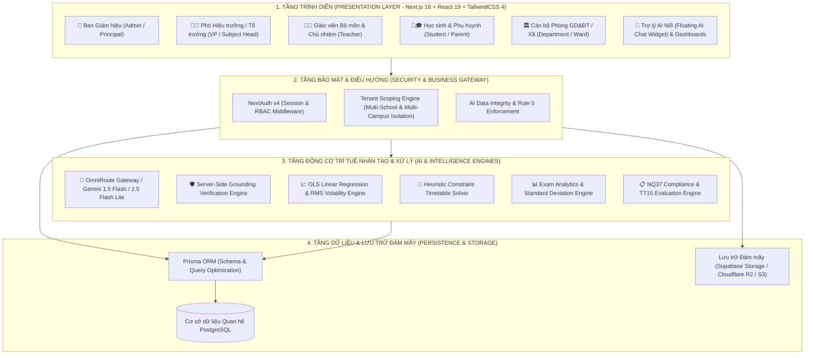
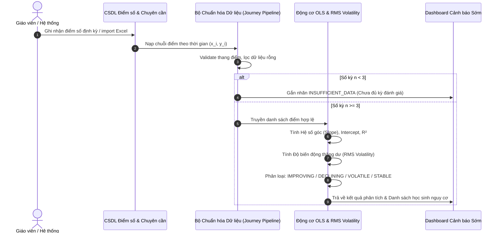
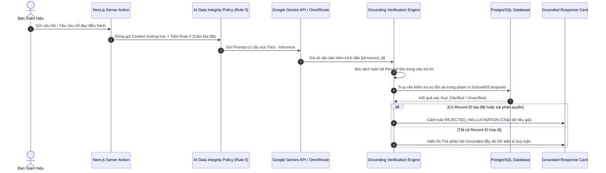
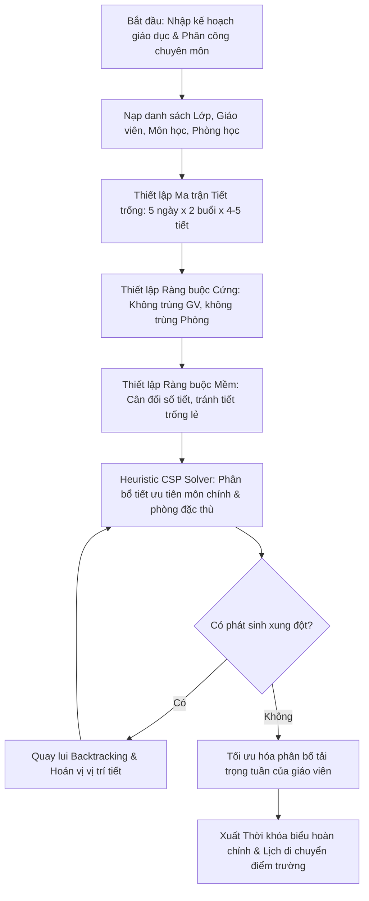

# SƠ ĐỒ KIẾN TRÚC HỆ THỐNG VÀ LUỒNG XỬ LÝ DỮ LIỆU CHÍNH (`SCHOOL-MANAGEMENT`)

---

## I. SƠ ĐỒ KIẾN TRÚC HỆ THỐNG TỔNG THỂ (SYSTEM ARCHITECTURE)

Hệ thống Quản lý Nhà trường Thông minh đa điểm trường được thiết kế theo mô hình **Kiến trúc Phân tầng Hiện đại (Modern Layered Architecture)** với nguyên tắc phân định trách nhiệm rõ ràng (Separation of Concerns), an toàn dữ liệu đa trường (Multi-tenant Scoping) và tích hợp các động cơ trí tuệ nhân tạo (AI Engines) theo thời gian thực.

---

## II. BẢNG MA TRẬN LUỒNG XỬ LÝ DỮ LIỆU CỐT LÕI
### `[Dữ liệu đầu vào] → [Xử lý dữ liệu] → [AI xử lý/phân tích] → [Chức năng sản phẩm] → [Kết quả đầu ra]`

| STT | Luồng nghiệp vụ | Dữ liệu đầu vào (Input) | Xử lý dữ liệu (Preprocessing) | AI/Thuật toán phân tích (AI & Analytics Core) | Chức năng sản phẩm (Feature) | Kết quả đầu ra (Output) |
| :---: | :--- | :--- | :--- | :--- | :--- | :--- |
| **1** | **Phân tích Hành trình & Cảnh báo Sớm Học sinh** | • Điểm số theo các kỳ đánh giá ($x_i, y_i$). • Dữ liệu chuyên cần & nghỉ học. • Nhật ký can thiệp học sinh. | • Lọc điểm hợp lệ ($0.0 \le \text{score} \le 10.0$). • Sắp xếp theo trục thời gian. • Kiểm tra điều kiện tối thiểu ($n \ge 3$ kỳ). | **Mô hình Hồi quy Tuyến tính OLS & Độ biến động RMS Thặng dư**: $\text{Slope } a$, $\text{Intercept } b$, $R^2$, $\text{RMS Volatility}$. | **Module Hành trình Học sinh & Cảnh báo Sớm (Student Journey & Early Warning)** | • Nhãn xu hướng: *IMPROVING / DECLINING / VOLATILE / STABLE*. • Điểm cơ sở (Baseline) & Độ lệch ($\Delta$). • Cảnh báo đỏ tự động gửi tới GVCN/BGH. |
| **2** | **Trợ lý AI Điều hành & Tham vấn Chống Ảo giác** | • Câu hỏi/Yêu cầu của BGH/Giáo viên. • Snapshot dữ liệu trường học real-time (sĩ số, điểm trường, cơ sở vật chất, NQ37). | • Tiêm hệ thống nhắc **AI Data Integrity Policy (Rule 0)**. • Chuẩn hóa ngữ cảnh trường học đa điểm trường (Tenant Context). | **Google Gemini LLM** kết hợp **Server-Side Grounding Verification Engine**: Bóc tách `record_id` và đối chiếu thực tế với CSDL. | **Trợ lý AI Ban Giám hiệu & Chat Sư phạm Thông minh (Principal AI & Floating Chat)** | • Kịch bản chỉ đạo 2 phương án kèm điểm số ưu/nhược điểm & căn cứ pháp lý. • Thẻ phản hồi Grounded Response Card minh bạch nguồn gốc dữ liệu. |
| **3** | **Xếp Thời khóa biểu Tự động Đa điểm trường** | • Danh sách lớp, giáo viên, môn học. • Định mức tiết/tuần theo phân phối chương trình. • Danh mục phòng học chuyên dụng, khoảng cách điểm trường. | • Khởi tạo ma trận lịch trống (Timetable Matrix). • Ràng buộc cứng: GV không trùng tiết, phòng không quá tải. • Ràng buộc mềm: Tránh tiết trống lẻ, phân bổ đều buổi. | **Heuristic Constraint Satisfaction Problem (CSP) Solver**: Thuật toán tìm kiếm heuristic kết hợp quay lui thông minh (Backtracking). | **Module Xếp TKB Tự động & Quản lý Phân công (Smart Timetable Scheduler)** | • Lưới Thời khóa biểu toàn trường chuẩn xác 100% không xung đột. • Báo cáo tải trọng công tác giáo viên & lịch luân chuyển điểm trường. |
| **4** | **Phân tích Phổ điểm & Đánh giá Chất lượng Đề thi** | • Bảng điểm chi tiết bài thi các lớp/khối. • Ma trận đề thi & độ khó câu hỏi. • Dữ liệu điểm danh phòng thi. | • Loại trừ dữ liệu vắng thi/bỏ thi. • Chuẩn hóa thang điểm 10. • Nhóm theo khối/lớp/môn. | **Exam Analytics Engine**: Tính toán phân phối tần số (Histogram), Độ lệch chuẩn ($\sigma$), Phương sai, Độ phân hóa (Discrimination Index). | **Module Phân tích Kỳ thi & Chất lượng Giảng dạy (Exam Analytics Dashboard)** | • Biểu đồ phổ điểm trực quan (Normal Distribution vs. Skewed). • Đánh giá mức độ phân hóa học lực học sinh & khuyến nghị điều chỉnh đề thi. |

---

## III. SƠ ĐỒ CHI TIẾT CÁC LUỒNG XỬ LÝ CHÍNH (DETAILED PROCESS FLOWS)

### 1. Luồng Phân tích Hành trình Học sinh (Student Journey & Early Warning Flow)

---

### 2. Luồng Trợ lý AI Điều hành & Kiểm chứng Toàn vẹn Dữ liệu (AI Grounding Flow)

---

### 3. Luồng Xếp Thời khóa biểu Thông minh (Smart Timetable Solver Flow)

---

## IV. TỔNG KẾT VÀ GIÁ TRỊ VẬN HÀNH

1. **Tính Tự động hóa & Khép kín**: Toàn bộ chuỗi từ nhập liệu thô, chuẩn hóa, phân tích thông minh đến hiển thị cảnh báo đều diễn ra tự động với độ trễ dưới 2 giây.
2. **Minh bạch & An toàn Tuyệt đối**: Không phụ thuộc hoàn toàn vào "hộp đen" AI; mọi nhận định của LLM đều được kiểm chứng chéo với CSDL thực tế; các quyết định cảnh báo điểm số đều dựa trên nền tảng toán học OLS tường minh.
3. **Thích ứng Đặc thù Giáo dục Việt Nam**: Hỗ trợ toàn diện mô hình trường liên cấp, trường nhiều điểm trường xa, đáp ứng đầy đủ Thông tư 15/2020/TT-BGDĐT và Nghị quyết 37/2025/NQ-HĐND.
